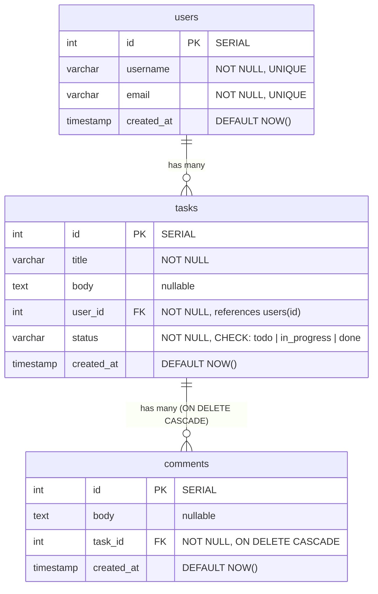
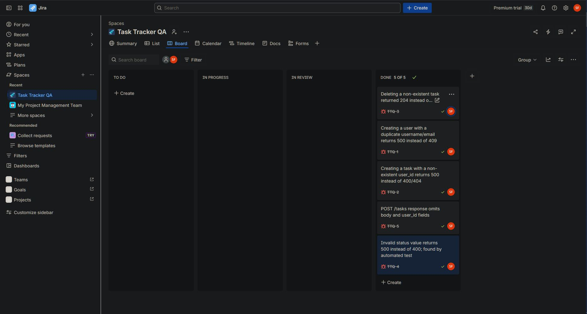

# Task Tracker QA


A task-tracker REST API built as a **QA engineering portfolio project**. The application itself is deliberately simple — the focus is on how it's tested: an isolated automated test suite, real bugs found and tracked in Jira, test-driven bug fixes, and CI running the full suite on every push.

## Tech Stack

- **Python / FastAPI** — REST API
- **PostgreSQL 16** — relational database with enforced constraints (foreign keys, CHECK, UNIQUE, cascade rules)
- **psycopg** — raw parameterized SQL (no ORM)
- **pytest** — automated test suite with fixture-based isolation
- **Docker & Docker Compose** — full stack runs with one command
- **GitHub Actions** — CI running the suite on every push
- **Jira** — bug tracking with full reproduce/expected/actual write-ups

## Architecture

Two containers orchestrated by Docker Compose:

- `db` — PostgreSQL with a persistent named volume
- `app` — FastAPI service, connecting to the database over the Compose network via an environment-configured connection string

Schema: `users` → `tasks` → `comments`, linked by foreign keys. Task status is constrained at the database level via a CHECK constraint; comments are removed automatically when their parent task is deleted (`ON DELETE CASCADE`).



## Running the App

```bash
docker-compose up --build
```

Then open the interactive API docs at http://localhost:8000/docs

## Running the Tests

Tests run against a **separate test database** (`taskdb_test`) so they never touch application data.

```bash
# one-time setup: create and initialize the test database
docker-compose exec db psql -U Admin -d taskdb -c "CREATE DATABASE taskdb_test;"
docker-compose exec -T db psql -U Admin -d taskdb_test < schema.sql

# run the suite
pip install -r requirements.txt
pytest -v
```

## Test Strategy

**Isolation.** An autouse pytest fixture truncates all tables (with identity reset) before every test, so each test starts from an identical empty state. Every test arranges its own prerequisite data — no test depends on another, and the suite passes in any order.

**Happy-path coverage.** Every endpoint (create/get/list/update/delete for tasks, create for users) is tested for correct status codes, response contracts, and — for mutations — persisted after-state verified by read-back.

**Negative & edge-case coverage.** Duplicate users, foreign-key violations, missing resources (404s), invalid enum values, and missing required fields. These tests exercise all three validation layers:

1. **Pydantic** — malformed requests rejected with 422 before reaching application code
2. **Application code** — constraint violations translated into correct HTTP errors (409/400/404) by catching specific psycopg exceptions
3. **Database** — UNIQUE, CHECK, and foreign-key constraints as the last line of defense

**Test-driven bug fixing.** Bugs were reproduced with a failing test first, then fixed, then verified green — the failing state is preserved in commit history.

## QA Process — Bugs Found & Tracked

Five real bugs were found during development, logged in Jira with steps to reproduce, expected vs. actual behavior, and severity. Three were found by manual exploratory testing through the API docs; two were caught by writing automated tests.

| Ticket | Bug | Found by | Status |
|--------|-----|----------|--------|
| TTQ-1 | Duplicate username/email returned 500 instead of 409 | Manual testing | Fixed |
| TTQ-2 | Task with non-existent user_id returned 500 instead of 404 | Manual testing | Fixed |
| TTQ-3 | Deleting a non-existent task returned 204 instead of 404 (root cause: driver rowcount returned -1) | Manual testing | Fixed |
| TTQ-4 | Create-task response omitted body and user_id fields | Automated test | Fixed |
| TTQ-5 | Invalid status value returned unhandled exception instead of 400 | Automated test | Fixed |

Commits reference their ticket IDs (e.g. `fix: return 409 on duplicate user (TTQ-1)`).


https://solomonfoster25.atlassian.net/jira/software/projects/TTQ/boards/3?jql=&atlOrigin=eyJpIjoiM2M5OWJjMzQzMWYxNGJmM2E5MTg4MGYzMTg1ZDkxMGQiLCJwIjoiaiJ9 

## CI

Every push runs the full suite in GitHub Actions against a fresh PostgreSQL service container with a health check gating test execution. CI caught a real "works on my machine" defect on its first run (untracked `__init__.py` files breaking imports on a clean clone).

## Known Improvements

- Move database credentials from compose/env defaults into a `.env` file (`.env` is already gitignored)
- Add a health check to the `db` service so `depends_on` waits for readiness locally, matching CI
- Wire up the `comments` endpoints and add a cascade-behavior test (schema support already in place)
- Duplicate status validation at the Pydantic layer (`Literal` type) for faster failure alongside the DB CHECK constraint
- Transaction-based test isolation as a faster alternative to truncation
